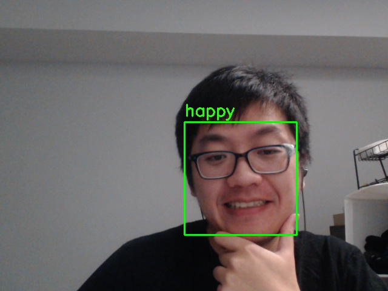
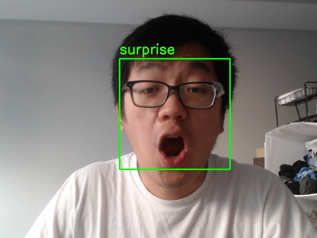
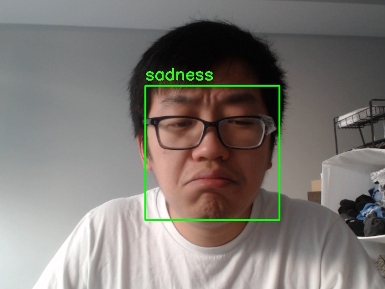

# Facial Expression Recognition

### How to train model

* Using the the file with prefix train
* Example: `python train_vgg16`

### How to run camera app:

* Package Requirement: tkinter, cv2, PIL, numpy, pytorch, argparse, imutils, dlib

* flag: `--model ./path/to/your/model`

* Example: `python camera.py --model ./model_data/vgg16.pt`

* Example interface:

  

* Example snapshot(take photo button):
  
  

  

  
