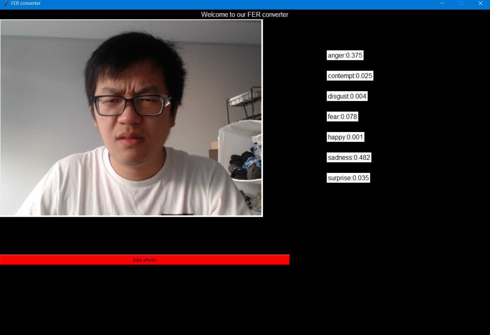
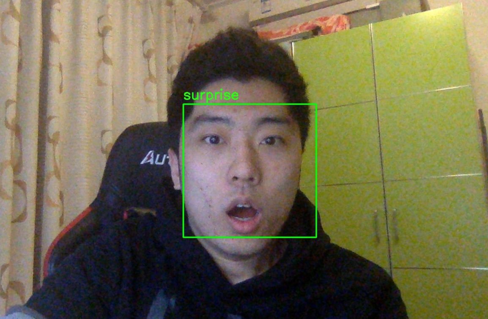
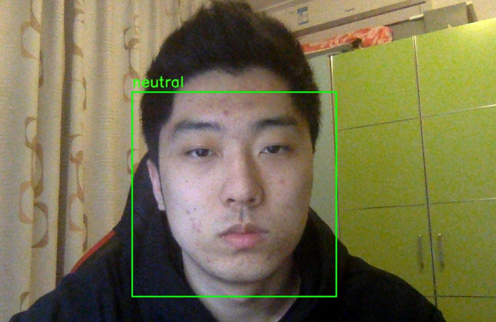

# Facial Expression Recognition

  

## Running the program

### Dependencies
We used python3.7 for this project, along with the following dependencies:
* torch
* opencv-python
* cmake
* dlib
* matplotlib
* imutils
* numpy
* h5py
* sklearn
* tkinter
* PIL

### Train model
* Run `python3 main.py -train_model <model_name>` from the repository directory
  * The `<model_name>` can be one of `{bipart_cnn, dcnn_fer13}`
  * E.g., run `python3 main.py -train_model dcnn_fer13`
  
### Test model
* Run `python3 main.py -test_model <model_name>` from the repository directory
  * The `<model_name>` can be one of `{bipart_cnn, dcnn_fer13, bipart_ck+}`
  * E.g., run `python3 main.py -test_model dcnn_fer13`

### Save data
* Run `python3 main.py -save_data <data_name>` from the repository directory
  * The `<data_name>` can be one of `{fer2013, ck_plus, hog_bipart, and fer2013_bipart}`
  * E.g., run `python3 main.py -save_data fer2013`
  
### Try out our interactive UI:
We've recorded a demo for this UI, in case the dependency is too big to run:
https://drive.google.com/file/d/1Xr8dEYBNQW8HhDFEjfMvNZAGv32GZgvw/view?usp=sharing

* Package Requirement: tkinter, cv2, PIL, numpy, pytorch, argparse, imutils, dlib

* command: `python3 camera.py --model <path/to/your/model>`

* Example: `python3 camera.py --model ./model_data/cnn_fer2013.pt`

* Example snapshot(take photo button):
  
  

  

  
  
  
  
  
